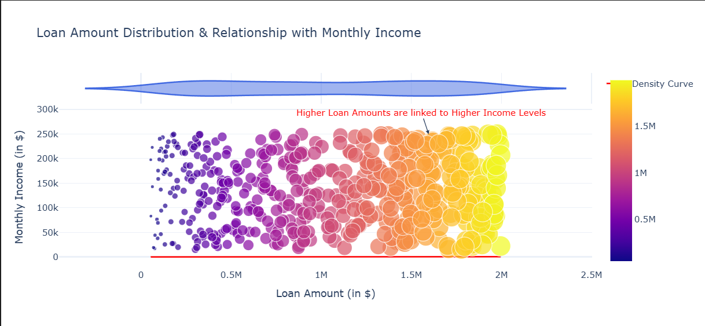

# Smart-Loan-Recovery-System

---

## Smart Loan Recovery System with Machine Learning

This project outlines how to build a smart loan recovery system using Machine Learning, as presented by Aman Kharwal. Loan defaults present a significant challenge for financial institutions, impacting profitability and cash flow. By leveraging historical loan repayment data, borrower profiles, and payment behaviours, this system aims to **optimize collection efforts, minimize recovery costs, and maximize loan repayments**.

### Dataset Overview

The loan recovery system is built using a dataset that includes comprehensive borrower profiles, loan details, and repayment histories. Key attributes within this dataset include:

*   **Demographic Information**: Age, employment type, income level, and number of dependents.
*   **Loan Details**: Loan amount, tenure, interest rate, and collateral value.
*   **Repayment History**: Number of missed payments, days past due, and monthly EMI payments.
*   **Collection Efforts**: Collection methods used, number of recovery attempts, and legal actions taken.
*   **Loan Recovery Status**: Indicates whether the loan was fully recovered, partially recovered, or remains outstanding.

*(The dataset can be downloaded from the source.)*

### Building the Smart Loan Recovery System

The initial steps involve importing the dataset and reviewing its summary statistics.

### Data Analysis and Visualisations

The project includes several visualisations to analyse key data distributions and relationships that impact loan recovery:

*   **Loan Amount Distribution & Relationship with Monthly Income**
    *   This graph demonstrates a **positive relationship between loan amounts and monthly income**, indicating that individuals with higher income levels tend to secure larger loans. The density curve at the top of the graph highlights that higher loan amounts are more frequent among higher income brackets. This finding underscores the proportionality between income and loan size, suggesting an income-based approach in loan approvals or customer profiling.

*   **How Payment History Affects Loan Recovery Status**
    *   This visualisation illustrates the impact of payment history on loan recovery. Loans with **on-time payments are mostly fully recovered**. Delayed payments result in a mix of partial and full recoveries, with some loans ending up written off. Crucially, loans with **missed payments have a significantly lower recovery rate**, with most of them either partially recovered or written off.

*   **How Missed Payments Affect Loan Recovery Status**
    *   This box plot provides a detailed view of the relationship between missed payments and loan recovery status. It shows that loans with partial recovery typically have up to 4 missed payments. **Fully recovered loans tend to have fewer missed payments, mostly between 0 and 2**. In contrast, written-off loans show a significantly higher range of missed payments, with several exceeding 6. This analysis confirms that a higher number of missed payments significantly reduces the likelihood of full recovery and increases the chances of loans being written off.

*   **How Monthly Income and Loan Amount Affect Loan Recovery**
    *   This scatter plot visualises how monthly income and loan amount influence loan recovery. It reveals that **higher-income individuals are more likely to fully recover their loans, even for larger amounts**. Conversely, borrowers in lower income brackets face a higher likelihood of loan write-offs or partial recovery. This trend clearly highlights the impact of income on loan recovery, demonstrating that higher earnings lead to better repayment outcomes and fewer write-offs, even for substantial loans.

### Borrower Segmentation with K-Means Clustering

To better understand different borrower profiles, **K-Means clustering** is used to create borrower segments based on monthly income and loan amount, along with other key financial and behavioural features.

*   **Borrower Segments Based on Monthly Income and Loan Amount**
    *   This scatter plot visually represents the **four distinct borrower segments** identified through K-Means clustering. These segments are named to reflect their characteristics:
        *   **Segment 1 (High Income, Low Default Risk)**: These borrowers take on moderate to high loan amounts, indicating financial stability.
        *   **Segment 0 (Moderate Income, High Loan Burden)**: This segment clusters around lower income levels and moderate loan sizes, reflecting potential financial strain.
        *   **Segment 2 (Moderate Income, Medium Risk)**: Borrowers in this segment are distributed evenly across the graph, representing a balanced but cautious group.
        *   **Segment 3 (High Loan, Higher Default Risk)**: This group concentrates in high-loan areas, especially within specific high-income ranges, highlighting their susceptibility to default despite higher incomes.

### Early Detection System for Loan Defaults

The identified borrower segments are used to build a **classification model** to flag borrowers with a high default risk. A **Random Forest Classifier** is trained using financial and behavioural features to predict the probability of a borrower defaulting, generating 'risk scores'.

Based on these risk scores, a **dynamic recovery strategy** is assigned to each borrower, enabling data-driven and targeted recovery efforts:

*   **Immediate legal notices & aggressive recovery attempts**: For high-risk borrowers with a risk score **above 0.75**.
*   **Settlement offers & repayment plans**: For moderate-risk borrowers with a risk score **between 0.50 and 0.75**.
*   **Automated reminders & monitoring**: For low-risk borrowers with a risk score **below 0.50**.

### Conclusion

By leveraging borrower profiles, payment behaviours, and clustering techniques, this smart loan recovery system can effectively **identify high-risk borrowers early and assign targeted, cost-effective recovery strategies based on their individual risk levels**.

---
